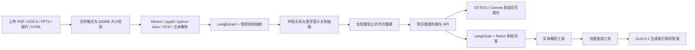

# GraphRAG Studio 系统演示手册

> 适用版本：GraphRAG Studio v1.4.0
> 演示地址：<http://127.0.0.1:8000>  
> 推荐演示时长：8～10 分钟；文末提供 5 分钟压缩版流程。

## 一、演示所需文件

演示时需要上传以下文件：

- [`演示上传文件-医疗知识样例.html`](../sample_data/演示上传文件-医疗知识样例.html)

该文件包含 5 条结构化医疗知识记录：偏头痛、胃食管反流病、过敏性鼻炎、缺铁性贫血和膝骨关节炎。系统解析后预计产生：

| 项目 | 预计结果 |
|---|---:|
| 逻辑页数 | 5 |
| 实体节点 | 73 |
| 文档关系 | 572 |
| 其中语义关系 | 60 |

语义关系包括 `HAS_SYMPTOM`、`DIAGNOSED_BY`、`TREATED_BY`、`TREATED_WITH` 和 `VISITS_DEPARTMENT`。实际结果会显示在文档列表的索引摘要中。

## 二、演示目标

这次演示需要让观看者清楚看到以下闭环：

1. 多格式文档可以上传并建立索引。
2. 系统不是只保存原文，而是抽取实体和语义关系形成知识图谱。
3. 所有实体通过“总览根节点 → 类型公共节点 → 实体节点”连接成统一图谱。
4. 图谱可以筛选、缩放、搜索、查看邻居和导出。
5. 问答系统会携带历史消息，并通过 LangChain/ReAct 调用真实图谱工具。
6. 答案附带工具调用记录和引用节点，可以回到图谱追溯来源。
7. 节点超过 500 个时自动从 SVG 切换为 Canvas，保证大图可用性。

## 三、技术路线



### 3.1 文档索引路线

```text
上传文件
  → 后端校验格式和大小
  → 创建文档记录
  → parsing：解析正文和逻辑页
  → extracting：抽取疾病、症状、药物、治疗、科室等实体
  → indexing：建立共现关系和语义关系
  → 重建“知识图谱总览 → 类型 → 实体”公共骨架
  → 返回 nodes、edges、pages、extractions、duration
```

### 3.2 智能问答路线

```text
当前问题 + 当前会话最近 10 条历史
  → LangChain ReAct Agent
  → resolve_graph_entities：解析问题中的图谱实体
  → get_graph_neighbors：按问题意图检索邻居
  → 模型只根据工具观察生成答案
  → 返回 answer、tool_calls、cited_nodes、agent、history_turns
```

当前模型通过 OpenAI 兼容接口调用 SiliconFlow 上的 `Pro/zai-org/GLM-5.1`。配置 API Key 时使用模型驱动的 `langchain-react`；API 不可用时自动进入 `deterministic-react-fallback`，继续基于知识图谱返回结果。

问答入口还包含混合路由：命中知识图谱时使用上述 ReAct 流程；“今天、最新、赛程、天气”等实时问题先联网检索并展示来源；其他未命中图谱的问题由通用大模型回答。页面会明确显示“知识图谱、联网检索、通用大模型”模式。

v1.4.0 增加多智能体协同、自动跨知识库判断和对话级智能体记忆。智能体管理页展示调用次数、基于用户反馈的准确率和平均延迟；问答页展示协同智能体、记忆命中和反馈按钮。

### 3.3 前后端技术组成

| 层次 | 主要技术 | 作用 |
|---|---|---|
| 前端 | 原生 HTML、CSS、JavaScript、Hash Router | 单页应用及页面路由 |
| 图谱可视化 | D3.js、SVG、Canvas | 力导向图、缩放、拖动、高亮和大图渲染 |
| 后端 | FastAPI、Pydantic、Uvicorn | REST API、参数校验和静态页面服务 |
| 文档解析 | MinerU、pypdf、python-docx、python-pptx、OCR | 多格式文档转文本 |
| 知识抽取 | LangExtract、规则抽取器 | 实体、字段和证据提取 |
| 图谱关系 | 共现规则、结构化字段规则、文本关系动词规则 | 建立局部和语义关系 |
| Agent | LangChain、ReAct、OpenAI 兼容接口 | 多轮工具调用和答案生成 |
| 存储 | JSON 文档库 | 保存文档、任务、节点、边、问答和批次 |
| 测试 | unittest、Playwright | F01～F15、移动端和性能验收 |

## 四、演示前检查

### 4.1 启动系统

如果系统尚未启动，在 PowerShell 中执行：

```powershell
cd C:\Users\Lenovo\Documents\实训项目\GraphRAG-Studio
python -m uvicorn graphrag_pipeline.api_server:app --host 127.0.0.1 --port 8000
```

浏览器打开：

```text
http://127.0.0.1:8000
```

当前系统已经在本机 8000 端口运行。正式演示前建议按 `Ctrl+F5` 强制刷新一次，以确保加载 v1.4.0 前端资源。

### 4.2 检查项目状态

依次确认：

- 页面底部显示 `API v1.4.0`。
- 右上角 API 状态为绿色。
- “系统状态”页面中的 `storage` 和 `langchain_react` 为正常。
- “系统总览”能够显示节点、关系、文档和问答数量。
- 上传样例文件所在位置可以正常访问。

上传文件的绝对路径为：

```text
C:\Users\Lenovo\Documents\实训项目\GraphRAG-Studio\sample_data\演示上传文件-医疗知识样例.html
```

### 4.3 建议的浏览器准备

- 使用 Chrome 或 Edge。
- 浏览器缩放保持 100%。
- 关闭无关标签页和弹窗。
- 提前复制本手册中的演示问题。
- 不要在正式演示前删除现有 Demo 数据。

## 五、8～10 分钟完整演示流程

### 步骤一：系统总览（约 40 秒）

操作：

1. 打开“系统总览”。
2. 指出知识节点、知识关系、文档数量和问答次数四项指标。
3. 指出右侧系统健康状态和页面右上角绿色 API 状态。

建议讲解：

> 这是系统总览页面。系统将文档、知识图谱、问答和搜索功能集成在一个 SPA 中。当前后端由 FastAPI 提供服务，首页会定时刷新系统统计和健康状态。

### 步骤二：上传演示文档（约 1 分钟）

操作：

1. 点击左侧“文档管理”。
2. 将 [`演示上传文件-医疗知识样例.html`](../sample_data/演示上传文件-医疗知识样例.html) 拖入上传区域，或者点击“选择文件”。
3. 系统显示“上传成功”后，在确认框中点击“是，开始索引”。
4. 观察页面底部任务状态和列表中的进度条。

需要指出的功能：

- 前端和后端都会检查文件格式与 200MB 大小限制。
- 上传错误会显示在对应文件行内，不只显示临时 Toast。
- 索引任务每 3 秒轮询一次，可以取消或失败后重试。
- 索引结束后会显示结果摘要。

预期结果：

```text
73 nodes · 572 edges · 5 pages · 73 extractions · X.Xs
```

建议讲解：

> 这份文件包含五种疾病及其症状、检查、治疗、药物和科室。系统先解析正文，再识别实体，最后建立共现关系和医学语义关系。索引结果不是黑盒，节点数、边数、页数、抽取数和耗时都会直接显示。

### 步骤三：展示知识图谱（约 1 分 30 秒）

操作：

1. 点击该文档对应的“查看图谱”。
2. 在左侧“来源文档”中确认选中了刚上传的 HTML 文件。
3. 指出图谱顶部的节点数、边数和 `CANVAS` 标记。
4. 使用鼠标滚轮缩放，拖动画布或节点。
5. 在图谱搜索框中输入“偏头痛”并按 Enter。
6. 点击“偏头痛”节点，查看右侧详情和邻居。
7. 点击一个邻居节点，例如“布洛芬”或“神经内科”。
8. 点击“适配”恢复全图视图。

需要指出的图谱结构：

```text
知识图谱总览
  ├─ 疾病 → 所有疾病实体
  ├─ 症状 → 所有症状实体
  ├─ 药物 → 所有药物实体
  ├─ 治疗 → 所有治疗实体
  └─ 科室 → 所有科室实体
```

建议讲解：

> 为避免知识图谱分成互不相连的小块，系统增加了全局根节点和类型公共节点。局部关系表达文档中的具体知识，全局骨架负责把不同文档和不同疾病组织成一个统一网络。当前节点超过 500 个，因此系统自动使用 Canvas；小图和搜索预览仍使用 SVG。

### 步骤四：说明语义关系（约 50 秒）

系统同时保存两类文档关系：

- `CO_OCCURS_IN`：两个实体在同一页或同一文本块中共同出现。
- 明确语义关系：疾病与症状、药物、检查、治疗和科室之间的具体联系。

以“偏头痛”为例：

```text
偏头痛 --HAS_SYMPTOM--> 搏动性头痛
偏头痛 --DIAGNOSED_BY--> 头颅MRI
偏头痛 --TREATED_BY--> 规律作息
偏头痛 --TREATED_WITH--> 布洛芬
偏头痛 --VISITS_DEPARTMENT--> 神经内科
```

如果需要展示原始关系数据，可以点击“导出 JSON”，在导出文件中搜索 `HAS_SYMPTOM` 或 `TREATED_WITH`。每条语义边还包含来源页码和证据文本。

### 步骤五：选择智能体（约 40 秒）

操作：

1. 点击左侧“智能体管理”。
2. 指出 Supervisor 自动路由，以及医疗、技术、联网、通用四个内置智能体。
3. 在医疗知识智能体卡片中展示绑定知识库、工具权限，以及调用次数、准确率和平均延迟。
4. 点击“选择该智能体”，系统自动进入问答页并选中医疗知识智能体。

建议讲解：

> 智能体不是只有一个图标入口。管理页会公开知识库、工具、联网权限和真实调用统计。准确率只依据用户反馈计算；没有反馈时显示“暂无评价”。

### 步骤六：多轮智能问答（约 2 分钟）

点击左侧“智能问答”，依次发送：

### 第一轮

```text
偏头痛有哪些典型症状和治疗方法？
```

观察并讲解：

- 页面先显示 thinking 动画。
- 回答中包含知识图谱实体名称。
- 展开 `Tool Calls`，应看到实体解析和邻居查询。
- 回答下方显示 Cited Nodes，可点击跳转到图谱。
- 底部显示 `Agent: langchain-react`；模型不可用时会显示回退模式。

### 第二轮追问

```text
它常用哪些药物，应该去什么科室？
```

需要强调：

> 第二轮没有再次写“偏头痛”。除了前端历史，后端还按对话和智能体保存记忆，因此重新进入该对话后仍能解析“它”指代的疾病。回答会显示“已调用对话记忆”。

### 跨知识库协同

保持“自动选择（Supervisor）”，发送：

```text
比较高血压的常见症状与 GraphRAG 的核心技术
```

页面应显示“多智能体协同 Supervisor”、医疗和技术两个协同智能体及各自知识库。点击“有帮助”后，反馈会计入两个参与智能体的准确率统计。

### 其他推荐问题

```text
反酸和烧心通常与什么疾病相关？
```

```text
缺铁性贫血有哪些典型症状、常用药物和建议科室？
```

```text
过敏性鼻炎常用哪些药物，应前往什么科室？
```

```text
膝骨关节炎有哪些症状和治疗方法？
```

### 步骤七：批量问答（约 30 秒，可选）

在输入框中每行输入一个问题：

```text
偏头痛有哪些症状？
胃食管反流病常用什么药？
过敏性鼻炎应该去什么科室？
```

点击“批量”，页面会调用批量创建接口和批次查询接口，并逐条展示结果。

建议讲解：

> 批量模式体现了后端接口不只服务单轮页面操作，也能支持批量评测或知识库质量检查。

### 步骤八：知识搜索（约 1 分钟）

### 实体搜索

1. 打开“知识搜索”。
2. 在“实体搜索”中输入“胃食管反流病”。
3. 点击结果卡片，在右侧查看一跳邻居子图。
4. 点击“查看图谱”或“智能问答”，展示跨页面联动。

### 路径搜索

1. 切换到“路径搜索”。
2. 起点选择“偏头痛”，终点选择“布洛芬”。
3. 最大跳数设置为 3。
4. 点击“查找路径”。

如果下拉列表较长，可以先点击下拉框后直接键入实体名称的前几个字进行定位。

### 子图搜索

1. 切换到“子图搜索”。
2. 输入“缺铁性贫血”。
3. 保持“包含邻居”选中并点击搜索。
4. 展示匹配实体和局部关系网络。

### 步骤九：系统状态与收尾（约 40 秒）

操作：

1. 打开“系统状态”。
2. 展示 MinerU、LangExtract、LangChain/ReAct、模型 API 和存储状态。
3. 展示系统支持的文件格式和最大文件大小。
4. 指出全部后端 API 均通过统一的前端 API 封装访问。

建议总结：

> 这个系统完成了从文档上传、知识抽取、语义图谱构建，到多轮 Agent 问答和知识追溯的完整闭环。它既能演示知识网络，也提供任务管理、异常回退、响应式页面和自动化验收等工程能力。

## 六、5 分钟压缩版流程

| 时间 | 操作 | 核心讲解 |
|---:|---|---|
| 0:00～0:30 | 系统总览 | FastAPI 后端、SPA 前端、系统指标 |
| 0:30～1:20 | 上传 HTML 并索引 | 多格式解析、实体抽取、索引摘要 |
| 1:20～2:20 | 打开知识图谱 | 类型公共节点、全图连通、Canvas 大图 |
| 2:20～3:50 | 两轮问答 | 历史消息、LangChain/ReAct、Tool Calls、引用节点 |
| 3:50～4:30 | 实体或子图搜索 | 搜索结果和跨页面联动 |
| 4:30～5:00 | 系统状态与总结 | API、自动回退、测试覆盖 |

若索引时间较长，可提前完成上传和索引，正式演示时从文档结果摘要开始，同时口头说明上传过程。

## 七、演示时建议使用的讲解稿

> GraphRAG Studio 的目标是把非结构化文档转换为可以浏览、搜索和问答的知识网络。首先，我上传一份包含五种疾病的 HTML 文档。系统会校验文件，异步解析正文，抽取疾病、症状、检查、治疗、药物和科室实体，并建立共现及医学语义关系。
>
> 索引完成后，页面会显示节点数、关系数、页数和耗时。进入图谱页面后，可以看到所有实体通过“知识图谱总览”和类型公共节点形成统一网络。当前图谱超过 500 个节点，所以系统自动使用 Canvas 渲染；局部小图仍使用 SVG。
>
> 接下来我询问“偏头痛有哪些典型症状和治疗方法”。后端并不是把整个文档直接交给模型，而是由 LangChain/ReAct Agent 先解析实体，再查询图谱邻居，最后只根据工具返回的图谱事实生成答案。Tool Calls 展示了真实执行过的工具，Cited Nodes 可以跳回图谱。
>
> 第二轮我只问“它常用哪些药物，应该去什么科室”，系统仍能理解“它”指偏头痛，因为当前会话历史被传入后端。最后，实体搜索、路径搜索和子图搜索可以从不同角度探索知识。整个系统形成了“文档—图谱—Agent—答案—证据”的闭环。

## 八、常见问题和现场预案

### 8.1 页面打不开

执行：

```powershell
cd C:\Users\Lenovo\Documents\实训项目\GraphRAG-Studio
python -m uvicorn graphrag_pipeline.api_server:app --host 127.0.0.1 --port 8000
```

然后刷新 <http://127.0.0.1:8000>。

### 8.2 页面仍显示旧版本

按 `Ctrl+F5` 强制刷新，确认底部显示 `API v1.4.0`。

### 8.3 上传后没有开始索引

- 确认在上传成功后的确认框中点击了“是，开始索引”。
- 点击文档列表中的“开始索引”。
- 点击“刷新”重新获取任务状态。

### 8.4 模型回答较慢

- 问答接口超时时间为 60 秒。
- GLM 模型通常需要十几秒完成两次工具调用和最终回答。
- 如果模型或网络不可用，系统会切换到 `deterministic-react-fallback`，仍会返回图谱结果。

### 8.5 图谱节点过多、画面较密

- 在左侧按“来源文档”选择刚上传的 HTML 文件。
- 只保留 `DISEASE`、`SYMPTOM`、`DRUG`、`DEPARTMENT` 等需要展示的类型。
- 使用顶部搜索框直接聚焦“偏头痛”。
- 点击“适配”恢复视图。

### 8.6 问答没有召回刚上传的实体

- 确认文档状态为 `indexed`。
- 确认结果摘要中节点数不为 0。
- 使用“知识搜索”先搜索实体名称，确认实体已经进入图谱。
- 问题中第一次先使用完整实体名称，第二次再演示代词追问。

## 九、可能被问到的答辩问题

### 9.1 大模型在系统中有什么作用？

大模型负责在 ReAct 流程中选择图谱工具、理解问题意图并根据工具观察组织自然语言答案。实体、关系、来源和引用仍由知识图谱提供，不让模型脱离图谱自由编造。

### 9.2 是否真的使用了 LangChain/ReAct？

是。在线模式通过 LangChain Tool Binding 强制执行实体解析和邻居查询，工具观察被返回给模型后再生成答案。接口会返回 `agent=langchain-react` 和真实 `tool_calls`。无模型环境则使用确定性 ReAct 回退。

### 9.3 多轮对话如何实现？

前端维护当前会话消息，发送新问题时携带最近 10 条历史。后端规范化用户和助手角色，并把历史同时用于代词消解、实体解析和模型上下文。

### 9.4 图谱为什么不会分成很多孤立块？

每个普通实体都会连接到对应类型公共节点，所有类型公共节点再连接到“知识图谱总览”根节点。因此局部文档关系保留的同时，全图始终保持整体连通。

### 9.5 共现关系和语义关系有什么区别？

共现关系只说明两个实体在同一页或文本块出现；语义关系说明具体含义，例如疾病“具有”某症状、“使用”某药物或“建议前往”某科室。系统同时保存两者，避免在证据不足时强行推断关系。

### 9.6 大图如何保证性能？

节点数不超过 500 时使用 SVG，便于精细交互；超过 500 时切换 Canvas，减少 DOM 节点数量。系统已有 40 节点、780 条边的性能测试，以及 501 节点切换 Canvas 的边界测试。

### 9.7 系统如何降低模型幻觉？

- 回答前必须调用图谱工具。
- 系统提示要求只能基于工具观察。
- 返回引用节点，支持跳回图谱验证。
- 模型失败时使用确定性图谱回答，不直接生成无依据内容。

### 9.8 当前系统有哪些可继续改进的方向？

- 接入 Neo4j 等图数据库以支持更大规模图计算。
- 使用向量检索与图路径检索的混合召回。
- 增加关系置信度、人工审核和知识版本管理。
- 对长文档实行增量索引和分布式任务队列。
- 对问答质量增加标准数据集和自动评分。

## 十、演示完成检查表

- [ ] Dashboard 指标和健康状态正常。
- [ ] 成功上传指定 HTML 文件。
- [ ] 索引结果显示 5 页、约 73 个节点和 572 条关系。
- [ ] 图谱显示 `CANVAS`，可以缩放和聚焦节点。
- [ ] 展示“知识图谱总览 → 类型 → 实体”结构。
- [ ] 第一轮问答展示 Tool Calls 和 Cited Nodes。
- [ ] 第二轮代词追问展示 `history 2 turns`。
- [ ] 展示实体搜索或子图搜索。
- [ ] 系统状态显示 v1.4.0 和 LangChain/ReAct 可用。
- [ ] 用一句话总结“文档—图谱—Agent—证据”的闭环。
